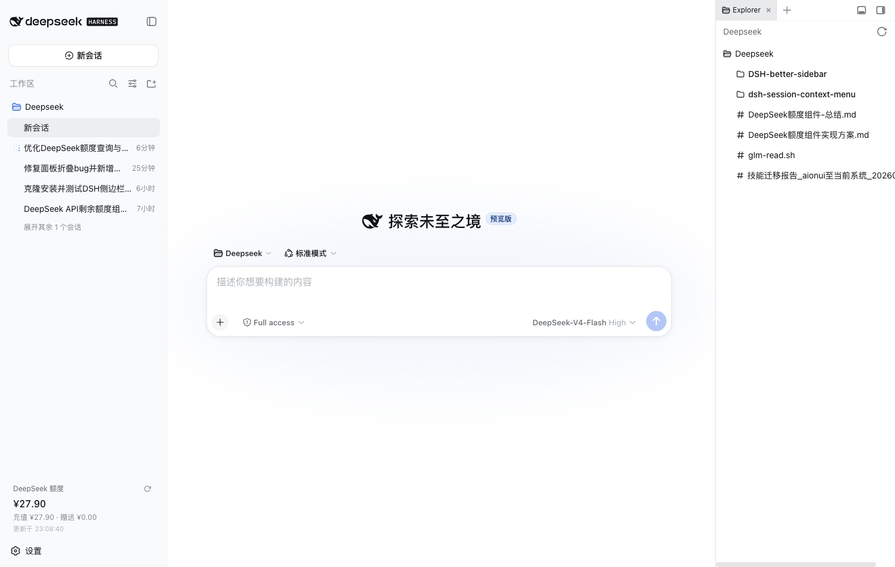
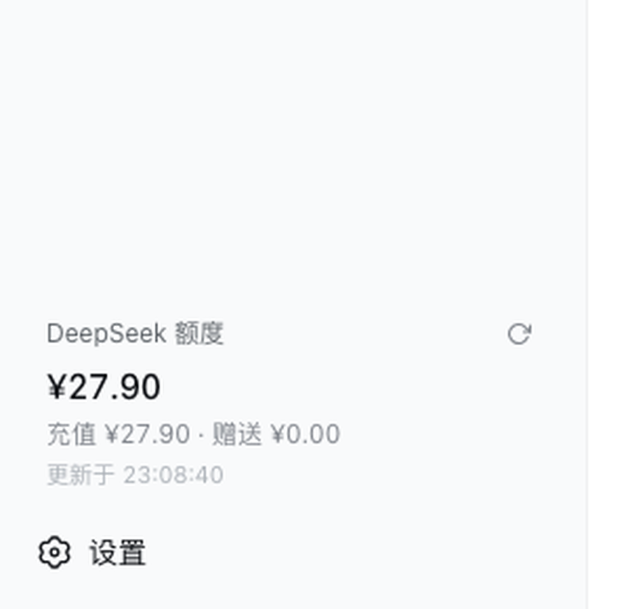
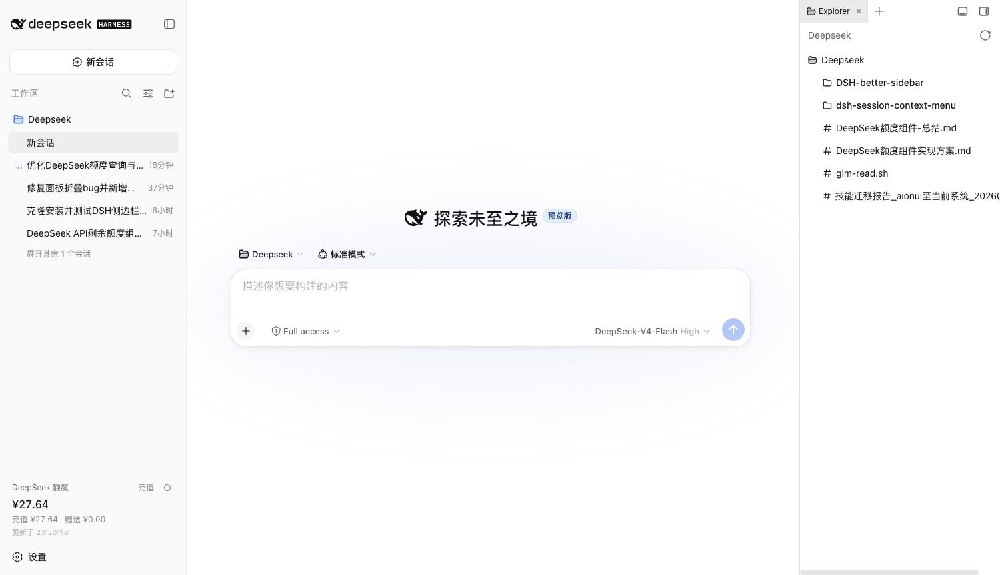
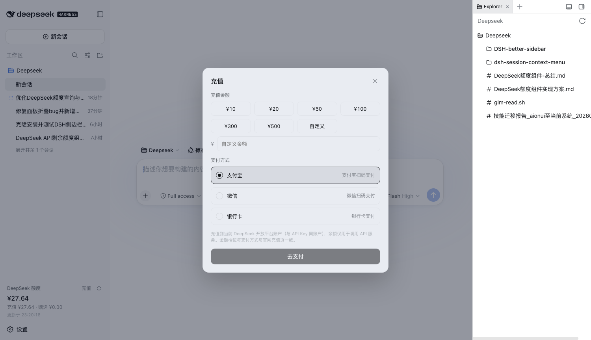
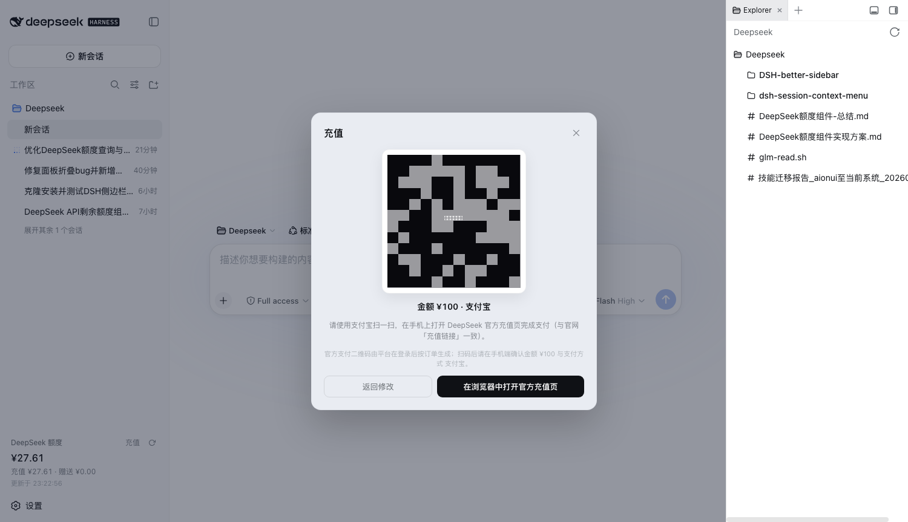

# dsh-deepseek-quota

> DeepSeek Harness Web 侧边栏的 **DeepSeek API 剩余额度卡片 + 充值面板** 插件。
> 实时展示官方余额（总余额 / 充值构成 / 赠送余额 / 期间已用 / 更新时间），每 60 秒自动刷新；
> 卡片内提供「充值」入口，弹出居中充值面板（金额档位与支付方式与 DeepSeek 官网一致），
> 扫码打开官方充值页完成支付。数据来自 DeepSeek **官方 `/user/balance` 接口**，API Key 全程不出 Host 进程。

[](LICENSE)
[](package.json)
[](https://github.com/cn-scuo-oo/dsh-deepseek-quota/releases)

---

## 目录

- [功能特性](#功能特性)
- [适用平台](#适用平台)
- [安装](#安装)
- [配置 API Key](#配置-api-key)
- [使用指南](#使用指南)
- [充值说明（重要）](#充值说明重要)
- [演示截图](#演示截图)
- [项目结构](#项目结构)
- [工作原理](#工作原理)
- [常见问题](#常见问题)
- [开发与测试](#开发与测试)
- [许可证与贡献](#许可证与贡献)

---

## 功能特性

| # | 能力 | 实现 |
|---|------|------|
| 1 | 实时余额展示 | 对接 DeepSeek 官方 `GET /user/balance`，展示总余额、充值/赠送构成、期间已用、更新时间 |
| 2 | 自动刷新 | 每 60 秒自动刷新 + 手动刷新按钮；刷新失败保留旧值（stale-while-error） |
| 3 | 低余额警示 | 余额 ≤ 0 时主数字变红；侧边栏收起态显示 `!` |
| 4 | 充值入口 | 卡片头部「充值」按钮 → 居中充值面板（金额档位/支付方式与官网一致） |
| 5 | 官方支付二维码 | 面板生成官方充值页二维码（`https://platform.deepseek.com/top_up`）供扫码支付 |
| 6 | 密钥安全 | API Key 只在 Host 进程内使用，浏览器侧经同源路由取数，Key 不落浏览器 |
| 7 | 视觉一致 | 复用侧边栏「设置」同源设计令牌（字体/颜色/间距/圆角/悬停态），宽度像素级对齐 |
| 8 | 宽/窄自适应 | 侧边栏展开显示完整卡片，收起退化为 32px 圆形按钮，点击展开侧边栏 |

## 适用平台

| 项 | 要求 |
|---|---|
| 宿主 | DeepSeek Harness Web（桌面端 / Web profile） |
| 运行环境 | Node **18+**（DSH 内嵌 Node 或系统 Node 均可） |
| 操作系统 | Windows（Git Bash / WSL）/ macOS / Linux |
| 数据源 | DeepSeek 官方 `GET /user/balance`（需有效 `DEEPSEEK_API_KEY`） |

## 安装

### 方式 A：一键安装（推荐）

```bash
git clone https://github.com/cn-scuo-oo/dsh-deepseek-quota.git
cd dsh-deepseek-quota
bash install.sh
```

脚本自动完成：检测 DSH profile 与 Node 版本（缺失给出修复指引）→ 复制插件文件到
`~/.dsh/profiles/web/vendor/dsh-deepseek-quota/` → 更新 profile `package.json`
（`dependencies` + `bundles` 声明）→ 建立 `node_modules` 符号链接。

安装完成后 **重启 DeepSeek Harness**（或页面按 Cmd+R 刷新），侧边栏底部「设置」上方即出现额度卡片。

> 自定义 profile 名 / 卸载：
> ```bash
> bash install.sh --profile myprofile     # 安装到指定 profile
> bash install.sh --uninstall             # 卸载（移除文件、声明与符号链接）
> ```

### 方式 B：手动安装（等价）

1. 把 `lib/`、`package.json`、`cordis.patch.yml` 复制到 `~/.dsh/profiles/web/vendor/dsh-deepseek-quota/`；
2. 编辑 `~/.dsh/profiles/web/package.json`：
   - `dependencies` 增加 `"dsh-deepseek-quota": "file:./vendor/dsh-deepseek-quota"`；
   - `dsh.profile.bundles` 追加 `"dsh-deepseek-quota"`；
3. 建立符号链接：`ln -s "$PWD/vendor/dsh-deepseek-quota" ~/.dsh/profiles/web/node_modules/dsh-deepseek-quota`；
4. 重启 DSH。

## 配置 API Key

无需编辑任何配置文件。在 DSH 应用内：

> **设置 → 模型 → 填入 `DEEPSEEK_API_KEY`**（与调用 DeepSeek 模型的 Key 是同一把）

插件经 DSH 的凭据服务（`~/.dsh/.credentials.yaml`）读取，Key **只在 Host 进程内**使用，
通过同源只读路由 `GET /dsh-quota/balance` 把归一化后的余额数据交给浏览器，
**API Key 永远不进入浏览器 / 前端代码 / 命令字符串**。

> 高级：可用环境变量 `DEEPSEEK_BASE_URL` 覆盖官方接口地址（联调本地 Mock / 公司代理）。

## 使用指南

1. **查看额度**：侧边栏底部「DeepSeek 额度」卡片显示 `¥余额` 大字 + 「充值 X · 赠送 Y」+ 「更新于 HH:MM:SS」；
2. **刷新**：点击卡片右上角刷新图标立即取数（加载中图标旋转）；
3. **充值**：点击卡片头部「充值」按钮 → 弹出居中面板：
   - 选择金额（¥10/20/50/100/300/500 或自定义，美元账户自动切换 $ 档位）；
   - 选择支付方式（支付宝 / 微信 / 银行卡，与官网一致）；
   - 点击「去支付」→ 中央展示官方充值页二维码 + 金额/方式摘要；
   - 手机扫码打开 DeepSeek 官方充值页完成支付，或点「在浏览器中打开官方充值页」直达；
4. **充值到账后**：回到侧边栏点击刷新图标（或等 60 秒自动刷新）即可看到最新余额。

## 充值说明（重要）

**如实说明**：DeepSeek 没有公开的「按订单生成支付二维码」API，官方充值页也禁止内嵌
（`content-security-policy: frame-ancestors 'none'`）。真正的按订单官方支付码只能在登录
平台后于官网生成。因此本插件面板展示的是**官方充值入口二维码**——即官网自己复制的
「充值链接」同一个地址（`https://platform.deepseek.com/top_up`）：

- 扫码后在手机端打开**本人账号**的官方充值页，按面板已选金额与支付方式完成支付；
- 面板提供金额/方式摘要与提示文案，避免误扫错金额；
- 支付完成后回到应用点击刷新，官方 `GET /user/balance` 立即返回最新余额。

> 安全合规：本插件只对接 DeepSeek 官方公开 API 与官方充值页，不涉及任何爬虫、
> 绕过官方计费或代收资金逻辑。

## 演示截图

> 截图来自真实运行实例（开发验证环境）。

| 侧边栏额度卡片（展开态） | 卡片区域放大 | 侧边栏底部（充值入口 + 设置对齐） |
|---|---|---|
|  |  |  |

| 充值面板（金额档位 + 支付方式） | 二维码视图（扫码支付，二维码已打码） |
|---|---|
|  |  |

## 项目结构

```
dsh-deepseek-quota/
├── lib/
│   ├── index.js          # Host 半：凭据解析 → 官方余额接口 → 同源路由 /dsh-quota/balance
│   └── client.js         # Client 半：侧边栏卡片 + 充值面板 + 内联 QR 编码器
├── package.json          # 插件清单（入口 / dsh bundle / client 注入声明）
├── cordis.patch.yml      # profile 组合层补丁（以一行插入 bundles）
├── install.sh            # 一键安装脚本（检测 + 复制 + 改写 profile + 符号链接）
├── scripts/
│   └── patch-profile.mjs # install.sh 依赖：安全改写 profile package.json（幂等）
├── tests/
│   └── smoke.test.mjs    # 冒烟测试（模块加载 / Host 路由行为 / 归一化逻辑）
├── docs/
│   └── screenshots/      # 功能截图
├── .env.example  .gitignore
├── README.md  LICENSE  CONTRIBUTING.md  SECURITY.md  CHANGELOG.md
└── .github/              # Issue 模板 + PR 模板
```

## 工作原理

```
浏览器 (Client 半)
  QuotaCard 组件 ──fetch──▶ GET /dsh-quota/balance（同源，无 CORS）
                                      │
                              Host 半 (lib/index.js)
                              1. ctx.credentials.resolve('DEEPSEEK_API_KEY')
                              2. fetch {baseURL}/user/balance  (Bearer, 15s 超时)
                              3. 归一化 → { totalBalance, grantedBalance,
                                            toppedUpBalance, updatedAt, … }
                                      │
                              DeepSeek 官方 API（Key 只在这一层出现）
```

- **数据流**：官方余额接口 → Host 归一化 → 同源只读路由 → 浏览器卡片；每 60 秒自动刷新；
- **状态机**：`loading → ready / error`；已有数据时刷新失败保留旧值并标注「更新失败」；
- **期间已用** = 组件加载以来余额的减少量（官方为预付费余额制，无“总配额/已用”字段，如实映射）；
- **充值面板**：注册于 `shell.overlay` 全屏浮层，居中模态，支持遮罩 / × / Esc 关闭。

## 常见问题

**Q：卡片不显示 / 一直转圈？**
先确认已在 设置 → 模型 填入 `DEEPSEEK_API_KEY`；然后看页面控制台是否有 `GET /dsh-quota/balance` 报错。插件默认挂在侧边栏底部「设置」上方，收起态是 32px 圆形按钮。

**Q：提示「未配置 DEEPSEEK_API_KEY」？**
在 设置 → 模型 中填写并保存后，点击卡片刷新按钮即可；无需重启。

**Q：余额显示不准 / 是负数？**
余额来自官方 `GET /user/balance`，为账户实时值（同一 Key 所有客户端合计）。面板中的
「期间已用」是从组件加载起的余额差分，不是账户历史总消耗。

**Q：充值后余额没变？**
官方到账可能有秒级延迟；回到应用点击刷新图标，或等 60 秒自动刷新。若仍不变，确认充值与 API Key 属于**同一平台账号**。

**Q：安装脚本报错？**
按脚本提示操作：未检测到 DSH 时先运行一次 DeepSeek Harness 生成 `~/.dsh`；profile 名不同时用 `--profile` 指定；Node 过旧按提示升级。

## 开发与测试

```bash
# 语法检查
node --check lib/index.js
node --check lib/client.js

# 冒烟测试（模块加载 / Host 路由行为 / 余额归一化）
node --test tests/smoke.test.mjs

# 端到端测试（模拟他人从零安装 → 启动 → 取数，覆盖成功/无Key/无效Key/超时）
node scripts/mock-deepseek.mjs &          # 本地 mock 上游（:8899，无真实 Key 也能联调）
node --test tests/e2e-install-test.mjs    # 会临时创建干净 DSH_HOME 执行 install.sh
```

> **无真实 Key 联调**：`DEEPSEEK_BASE_URL=http://127.0.0.1:8899` 时插件会走本地 mock 上游，
> 可完整体验「余额展示 → 刷新 → 充值面板 → 二维码」全流程，无需任何真实凭据。

## 我如何确认「别人装上就能用」？

安装后按此清单快速自检（1 分钟）：

1. **安装成功**：`bash install.sh` 输出 `安装完成`，且 `~/.dsh/profiles/web/package.json`
   的 `dependencies` 与 `dsh.profile.bundles` 中均出现 `dsh-deepseek-quota`；
2. **重启 DSH**（或页面 Cmd+R），侧边栏底部「设置」上方出现额度卡片（收起态为 32px 圆形 `¥` 按钮）；
3. **配置 Key**：设置 → 模型 → 填入 `DEEPSEEK_API_KEY`（与调用模型的 Key 同一把）；
4. **看到余额**：卡片显示 `¥XX.XX` 大字 + 「充值 ¥X · 赠送 ¥X」+「更新于 HH:MM:SS」；
5. **刷新**：点右上角刷新图标立即更新；**充值**：点「充值」弹出面板，选金额/支付方式 → 「去支付」出二维码；
6. **无 Key 联调**：`node scripts/mock-deepseek.mjs` + `DEEPSEEK_BASE_URL=http://127.0.0.1:8899`
   启动，无需真实凭据即可跑通全流程（CI 的端到端测试即按此路径验证）。

> 常见问题与排查见下方「常见问题」；测试全绿（冒烟 6 例 + 端到端 5 例）是发布的硬性门槛。

## 许可证与贡献

- 基于 [MIT License](LICENSE) 开源，可自由使用、修改、商用；
- 欢迎提 [Issue](https://github.com/cn-scuo-oo/dsh-deepseek-quota/issues) / PR，流程见 [CONTRIBUTING.md](CONTRIBUTING.md)；
- 安全反馈请走 [SECURITY.md](SECURITY.md)；
- 更新记录见 [CHANGELOG.md](CHANGELOG.md)。
